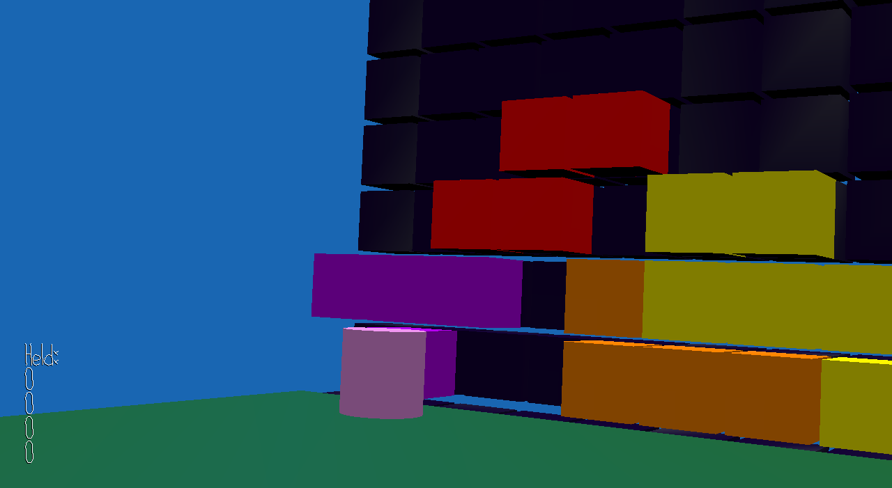

# Tetris Factory

Author: Jiwoo Yoo

Design: You and a friend work at a trash handler factory that turns trash into tetrominos. Your job is to place them at the magic matter destroying wall in rows. Failing to pick up the tetrominos from the conveyer belt will clog it, and stacking blocks past the wall's limits will break it. Your boss says you're on thin ice, so don't do either of these things or you'll surely get fired. Your friend will probably get fired too.

Networking:

Server (server.cpp):

Sends random blocks on conveyer belt for players to draw

Tells players when a block on the belt was taken

Holds status of tetris board, sends board for players to draw when board is updated

Holds player locations, sends other player location to draw other player

Client (playmode.cpp):

Players can send desired block at desired position for server to update board

Players can take from conveyer belt and tell server block was taken

Screen Shot:

How To Play:

WASD to move

Mouse movement to move camera

Spacebar to pick up block

Spacebar to place block

Left click to rotate block

Sources: All models made by me

This game was built with [NEST](NEST.md).